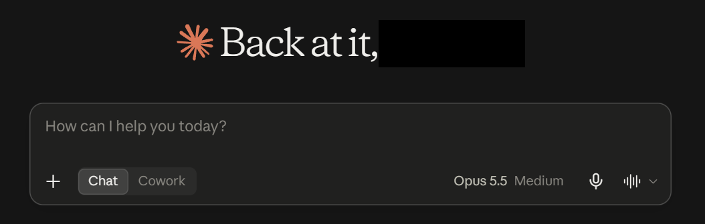

# Your first conversation

!!! note "Synthetic content"
    This module is mock material for the platform proof of concept.

Open Claude and you land on the home screen. Type your request in the message box and press Enter.

## What you can see

| Area | What it does |
|---|---|
| Message box | Where you type your request. Attach files with **+** |
| **Chat** / **Cowork** | Switch between a conversation and handing Claude a longer task |
| Model selector | Shows the model in use. Your organisation may fix this |
| Voice | Dictate instead of typing |

## A good first request

Ask for something you would normally spend twenty minutes on, and give Claude the context a new colleague would need.
