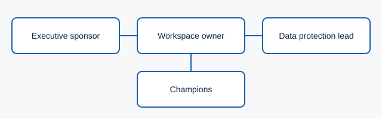

# Introduction to Claude governance

!!! note "Synthetic content"
    This module is mock material for the platform proof of concept.

Rolling Claude out well is mostly a set of decisions made *before* the first person signs in. This module walks through those decisions and who should own each one.

## Why a policy comes first

An AI usage policy gives people permission as much as it sets limits. Without one, cautious staff avoid the tool and confident staff improvise. A short, plain-English policy removes both problems.

A useful policy answers four questions:

1. **Who can use Claude**, and on which plan or workspace?
2. **What information can be shared**, and what must never be?
3. **Who reviews output** before it reaches a customer or a decision?
4. **Where do people go** with questions or incidents?

## Roles

| Role | Owns |
|---|---|
| Executive sponsor | The business case and the policy's sign-off |
| Workspace owner | Settings in the admin console, including retention |
| Data protection lead | What may be shared, and the retention period |
| Champions | Day-to-day questions and good examples |

## Decisions to make before launch

- The **retention period** for conversations, set in the admin console.
- Whether **projects** may hold customer documents.
- How people **report** a mistake or a suspected data issue.

## Check your understanding

- Which role signs off the policy?
- Where is the retention period configured?
